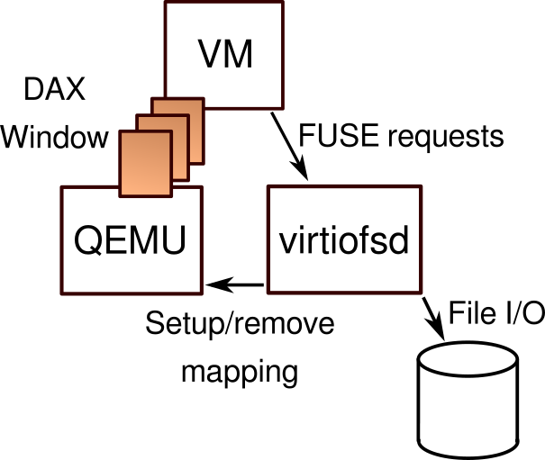

## Kata Containers 与 virtio-fs 技术分析与测试

### 1. 前言

当前云原生技术发展的如火如荼，容器化技术以及 Kubernetes 容器化应用管理平台，带来了全新的生态系统。随着容器技术的发展，容器运行时规范 OCI 也逐渐脱离 Docker 被单独提了出来，Kubernetes 长期使用的容器运行时是 runC，具有轻量、性能高等优点，但因为共用 Linux 内核以及 namespace 机制隔离的不彻底，存在一定的安全问题，业界涌现了好几个安全容器的解决方案，比如 Google 的 gVisor, Amazon 的 Firecracker，Vmware 的 CRX 等，开源世界里面比较有名的解决方案是 Kata Containers，本文主要就关注在安全容器 Kata Containers 的一些特性和体验。 

### 2. Kata Containers

Kata Containers 由一系列技术组成，来源于两个项目的合并，Intel Clear Containers 和 hyper.sh 的 runV，然后又加上 RedHat 贡献的 `virtio-fs`，一种在 guest 和宿主机之间共享文件系统的方案。涉及的技术有 QEMU/KVM，Linux kernel、文件系统、容器运行时、容器网络等，是一项比较复杂的组合产品，而且还保持着很高的新特性开发进度，本次主要体验和梳理 virtio-fs 相关的内容，这些内容有部分是来源于 Kata 的社区邮件列表以及 slack ，还有微信群，非常感慨，Kata 的社区真是非常的 nice，专业程度和热心都令人感动。

### 3. virtio-fs 文件系统结构



传统容器使用 cgroup 和 namespace 做进程、网络、文件系统挂载点等隔离，是非常轻量级的。而 Kata Containers 为了实现安全容器，使用了 VM 虚拟机作为强隔离手段，有独立的内核和虚拟机镜像，为了降低资源消耗，hypervisor 使用了非常小的 guest kernel 和 guest image，高度优化了内核的启动时间，最小化了内存占用，只提供容器负载所需要的最基本的服务。virtio-fs 文件系统，在资源消耗上也使用了多种优化特性。

在 Kata Containers 的配置文件 `configuration.toml` 中支持两种共享文件系统类型：之前默认是 virtio-9p ，现在则默认使用 virtio-fs。

#### 3.1 virtio-9p 和 virtio-fs 文件系统对比

1. virtio-9p 没有针对虚拟化场景提供优化
2. virtio-fs 利用了 hypervisor 和虚拟机处于相同节点的优势
    - DAX 特性，文件内容映射到宿主机的内存窗口，客户机直接访问宿主机的 page cache
    - 减少内存占用，因为客户机  cache 已经被绕过了
3. 相比 virtio-9p，virtio-fs 具有更好的 POSIX 合规性

### 4. 测试

Kata Containers 与整合使用 virtiofsd，把宿主机目录共享给微虚拟机使用。

测试环境版本: 

- Centos 8
- qemu-kvm 5.1i
- Kubernetes 1.18
- Containerd 1.4.4
- Kata Containers 2.0.4 

使用 Kubernetes 新版本的 **RuntimeClass** 对象，指定 **handler：kata**

#### 4.1 创建pod

```yaml
apiVersion: v1
kind: Pod
metadata:
  name: kata-alpine
spec:
  runtimeClassName: kata
  containers:
  - name: alpine
    image: alpine:latest
    imagePullPolicy: IfNotPresent
    command:
      - /bin/sh
      - "-c"
      - "sleep 60m"
  restartPolicy: Always
  nodeSelector:
    kubernetes.io/hostname: k8s05
```

#### 4.2 k8s05节点宿主机进程查看

```bash
[root@k8s05 ~]# ps aux|grep kata
root      500086  0.0  0.1 1412184 47796 ?       Sl   Jun18  14:00 /usr/bin/containerd-shim-kata-v2 -namespace k8s.io -address /run/containerd/containerd.sock -publish-binary /usr/bin/containerd -id 0965321e164975f01c85f997fbb0183773a9e97cb5767d99b5ea2b678735a8f5
root      500117  0.0  0.0 129064  4960 ?        Sl   Jun18   0:00 /usr/libexec/kata-qemu/virtiofsd --fd=3 -o source=/run/kata-containers/shared/sandboxes/0965321e164975f01c85f997fbb0183773a9e97cb5767d99b5ea2b678735a8f5/shared -o cache=auto --syslog -o no_posix_lock -f -o --thread-pool-size=1
root      500155  0.2  3.2 4367516 1059672 ?     Sl   Jun18  41:47 /usr/bin/qemu-system-x86_64 -name sandbox-0965321e164975f01c85f997fbb0183773a9e97cb5767d99b5ea2b678735a8f5 -uuid e0f45a3a-44f6-4328-8351-73eae4f75359 -machine q35,accel=kvm,kernel_irqchip -cpu host,pmu=off -qmp unix:/run/vc/vm/0965321e164975f01c85f997fbb0183773a9e97cb5767d99b5ea2b678735a8f5/qmp.sock,server,nowait -m 3072M,slots=10,maxmem=33194M -device pci-bridge,bus=pcie.0,id=pci-bridge-0,chassis_nr=1,shpc=on,addr=2,romfile= -device virtio-serial-pci,disable-modern=true,id=serial0,romfile= -device virtconsole,chardev=charconsole0,id=console0 -chardev socket,id=charconsole0,path=/run/vc/vm/0965321e164975f01c85f997fbb0183773a9e97cb5767d99b5ea2b678735a8f5/console.sock,server,nowait -device virtio-scsi-pci,id=scsi0,disable-modern=true,romfile= -object rng-random,id=rng0,filename=/dev/urandom -device virtio-rng-pci,rng=rng0,romfile= -device vhost-vsock-pci,disable-modern=true,vhostfd=3,id=vsock-4143818559,guest-cid=4143818559,romfile= -chardev socket,id=char-538bb1c14588b18e,path=/run/vc/vm/0965321e164975f01c85f997fbb0183773a9e97cb5767d99b5ea2b678735a8f5/vhost-fs.sock -device vhost-user-fs-pci,chardev=char-538bb1c14588b18e,tag=kataShared,cache-size=512M,romfile= -netdev tap,id=network-0,vhost=on,vhostfds=4,fds=5 -device driver=virtio-net-pci,netdev=network-0,mac=b6:9b:47:44:f7:29,disable-modern=true,mq=on,vectors=4,romfile= -netdev tap,id=network-1,vhost=on,vhostfds=6,fds=7 -device driver=virtio-net-pci,netdev=network-1,mac=3e:d9:ca:e5:4a:cb,disable-modern=true,mq=on,vectors=4,romfile= -rtc base=utc,driftfix=slew,clock=host -global kvm-pit.lost_tick_policy=discard -vga none -no-user-config -nodefaults -nographic --no-reboot -daemonize -object memory-backend-file,id=dimm1,size=3072M,mem-path=/dev/shm,share=on -numa node,memdev=dimm1 
root      500158  0.0  0.8 5667064 271696 ?      Sl   Jun18   0:03 /usr/libexec/kata-qemu/virtiofsd --fd=3 -o source=/run/kata-containers/shared/sandboxes/0965321e164975f01c85f997fbb0183773a9e97cb5767d99b5ea2b678735a8f5/shared -o cache=auto --syslog -o no_posix_lock -f -o --thread-pool-size=1
```

可以看到 Kata Containers v2 启动了新的与 Kubernetes 对接的 CRI 进程 containerd-shim-kata-v2、qemu 虚拟机，此外还有 2 个 virtiofsd 进程。为什么会启动 2 个 virtiofsd 呢？为了提高安全性，virtiofsd 进程 fork 自己，以便进入新的 mount/pid/net 命名空间，只有子进程内存映射，CPU 使用方面处于活跃状态。

还可以看到 qemu 虚拟化了设备 `vhost-user-fs-pci`，有一个 `tag` 为 kataShared，这个就是虚拟机要 mount 的源。`tag`就是一个自定义文件系统需要接收的参数，用于定义路径。

```
-device vhost-user-fs-pci,chardev=char-538bb1c14588b18e,tag=kataShared
```

> Note that Linux 4.19-based virtio-fs kernels required a different mount syntax.  mount -t virtio_fs none /mnt -o tag=myfs,rootmode=040000,user_id=0,group_id=0 instead.
> mount_tag: A tag which acts as a hint to the guest OS and is used to mount this exported path.

#### 4.3 进入 kata容器观察

```bash
[root@k8s01 kata-container]# kubectl exec -it kata-alpine -- sh
/ # df -h 
Filesystem                Size      Used Available Use% Mounted on
kataShared               74.0G     49.5G     24.4G  67% /
tmpfs                    64.0M         0     64.0M   0% /dev
tmpfs                     1.4G         0      1.4G   0% /sys/fs/cgroup
kataShared               74.0G     49.5G     24.4G  67% /etc/hosts
kataShared               74.0G     49.5G     24.4G  67% /dev/termination-log
kataShared               74.0G     49.5G     24.4G  67% /etc/hostname
kataShared               74.0G     49.5G     24.4G  67% /etc/resolv.conf
shm                       1.4G         0      1.4G   0% /dev/shm
kataShared               15.7G     12.0K     15.7G   0% /run/secrets/kubernetes.io/serviceaccount
tmpfs                    64.0M         0     64.0M   0% /proc/keys
tmpfs                    64.0M         0     64.0M   0% /proc/timer_list
```

可以看到容器已经挂载了 tag 定义的文件系统。tag 名字可以是任意取的，只要能 guest 挂载时候指定相同的就可以。对于 Kata Containers 来说，已经内部整合好了，不需要手工指定。

有时候如果处于调试目的或者是想看一下虚拟机的信息，可以配置 Kata Containers 开启 debug console， agent 会通过 qemu 提供的 vsock 接口，启动一个 debug 用的 bash 进程。

修改 Kata Containers 的配置文件：

```
[agent.kata]
debug_console_enabled = true
```

之后就可以通过 `kata-runtime exec $sandboxId` 接入虚拟机 bash 了

**Note:** 在较老版本的 Kata Containers 上，还需要在宿主机上预先启动 `kata-monitor` 进程，来让 `kata-runtime` 命令连接到 guest 中的 shell 。

#### 4.4 进入虚拟机查看

```bash
[root@k8s05 ~]# kata-runtime exec 0965321e164975f01c85f997fbb0183773a9e97cb5767d99b5ea2b678735a8f5
bash-4.2# df -h 
Filesystem      Size  Used Avail Use% Mounted on
rootfs          1.4G  350M  1.1G  25% /
dev             1.4G     0  1.4G   0% /dev
tmpfs           1.5G     0  1.5G   0% /dev/shm
tmpfs           1.5G   16K  1.5G   1% /run
tmpfs           1.5G     0  1.5G   0% /sys/fs/cgroup
kataShared       16G  1.6G   15G  11% /run/kata-containers/shared/containers
shm             1.5G     0  1.5G   0% /run/kata-containers/sandbox/shm
```

Kata Containers 根据 sandbox 的 ID，指定唯一的宿主机内存共享目录 source， 传递给 virtiofsd。 虚拟机挂载 virtiofsd 导出的共享的目录到 `/run/kata-containers/shared/containers`，然后再以 bind mount 的方式挂载进容器。

### 5. 持久卷挂载

网络持久卷比如 iscsi 也是能直接挂载进 Kata Containers 容器的，例如创建一个 pod，直接指定 pvc，pv 使用某一个 iscsi lun，然后在容器中创建一个文件。操作步骤如下：

```bash
[root@k8s01 kata-container]# kubectl exec -it iscsipd -- sh           
/ # cd  /mnt/iscsipd
/mnt/iscsipd # ls
lost+found
/mnt/iscsipd # touch aaaa.txt
```


在虚拟机里面已经通过 virtio-fs 挂载到了一个容器目录之下：

```bash
[root@k8s05 ~]# kata-runtime exec e96d0ce2249e9027f0e1102e66a0c0013473ac48a08824092150f3154ce050a6
bash-4.2# mount
rootfs on / type rootfs (rw,size=1444588k,nr_inodes=361147)
kataShared on /run/kata-containers/shared/containers type virtiofs (rw,relatime)
kataShared on /run/kata-containers/e96d0ce2249e9027f0e1102e66a0c0013473ac48a08824092150f3154ce050a6/rootfs type virtiofs (rw,relatime)
kataShared on /run/kata-containers/839162f25b7907bf91ecb027305e64dd5ccf36f55b15b600e9a84c8f3d6974db/rootfs type virtiofs (rw,relatime)

bash-4.2# find / -name aaaa.txt
/run/kata-containers/shared/containers/839162f25b7907bf91ecb027305e64dd5ccf36f55b15b600e9a84c8f3d6974db-b302a950a11a31b0-iscsipd/aaaa.txt
```

在宿主机上是识别为硬盘块设备 `/dev/sdd`，被 kubelet 挂载在特定目录下面，一个是 `sandbox_id` ，一个是应用 `container_id`：

```bash
[root@k8s05 ~]# lsblk
NAME      MAJ:MIN RM  SIZE RO TYPE MOUNTPOINT
sda         8:0    0   50G  0 disk 
├─sda1      8:1    0    1G  0 part /boot
sdc         8:32   0    2G  0 disk 
sdd         8:48   0    2G  0 disk /run/kata-containers/shared/sandboxes/e96d0ce2249e9027f0e1102e66a0c0013473ac48a08824092150f3154ce050a6/shared/839162f25b7907bf91ecb027305e64dd5ccf36f55b15b600e
```

如前文说，所有数据都要经过 virtio-fs，不管是镜像数据还是网络存储卷。虚拟机要和宿主机数据交互，就必须要穿过 qemu，virtio-fs 就是穿透 qemu 的桥梁，提供共享文件机制。数据相关的操作是在宿主机上，比如镜像层的合并，仍然是通过 containerd 的 snapshotter 插件完成的，底层仍然是使用了 overlayfs 文件系统。在 containerd 的配置文件中，有如下设置：

```toml
[plugins."io.containerd.grpc.v1.cri".containerd]
    snapshotter = "overlayfs"
    default_runtime_name = "runc"
    no_pivot = false
    disable_snapshot_annotations = true
    discard_unpacked_layers = false

[plugins."io.containerd.service.v1.diff-service"]
  default = ["walking"]
```

### 6. virtiofsd cache

guest 生成时会指定内存大小，virtiofsd 会共享使用 guest 的内存。默认使用 `memory-backend-file` 内存对象。

virtiofsd 共享使用VM内存，`configuration.toml` 配置参数 `default_memory` 是
qemu 命令行接收的参数：

```bash
-object memory-backend-file,id=dimm1,size=3072M,mem-path=/dev/shm,share=on -numa node,memdev=dimm1
```

guest 和 host 数据传输都是通过 virtio-fs，包括容器镜像和容器卷，读写权限取决于 virtiofsd 进程的权限。

### 7. DAX(直接访问)


DAX windows 是一块虚拟内存区域，通过 PCI Bar 把文件映射到 guest 里面，并不真正的占用主机那么多内存，即使有 100 个虚拟机，设置的 DAX cache 是 1G，也不会真的使用 100G 内存。

Kata Containers 官方下载的版本默认没有支持，需要编译安装 gitlab 托管的 virtio-fs qemu 项目 `qemu5.0-virtiofs-dax` 分支

通过 `configuration.toml` 中 `virtio_fs_cache_size` 来设置 dax window 的大小 ，qemu 初始化后的 `vhost-user-fs-pci` 设备如下：

```bash
-machine q35,accel=kvm,kernel_irqchip,nvdimm
-device nvdimm,id=nv0,memdev=mem0 -object memory-backend-file,id=mem0,mem-path=/opt/kata/share/kata-containers/kata-containers-image_clearlinux_2.0.4_agent_8b9607a742.img,size=268435456
-device vhost-user-fs-pci,chardev=char-ea09ec33d071ac42,tag=kataShared,cache-size=512M,romfile=
```

如果是 rootfs image 可以看到模拟的 nvdimm 信息，自己编译镜像的话，image_builder.sh 构建脚本会在 image 文件头部写入 dax metadata 信息。initrd image 看不到该信息。image 相当于是直接用 rootfs 引导，initramfs（initrd）是把 cpio+gz 打包压缩的 rootfs 解压到内存里，再用内存里的 initramfs 来引导。前者可以利用 dax，让 guest os 认为这就是个 dimm  内存，不需要再加载到另一块内存里，后者就是需要解压到一块内存。

DAX 背后的想法是避免在 guest 中使用 _second_ 缓冲区缓存。一般对于常规文件，guest 会维护自己的文件系统缓冲区。

现在呢，对于与 virtio-fs 共享的文件，由于它们驻留在主机上，您将在主机上拥有一份缓存副本，然后 virtio-fs 会将其发送给 guest ，然后 guest 就也有了一份副本，成本就比较高。

DAX 就是为了解决这个问题的，它所做的就是将主机 buffer map 到客户机中，guest 使用与主机相同的物理内存，即使它使用不同的虚拟地址。如果没有 DAX，内存使用量可能会非常大，因为每个 guest 都有自己的文件缓冲区。例如，如果您启动一个 Fedora 容器并 `dnf install something` ，您将看到内存使用量增加了约 300M，因为在该操作期间读取/写入了许多文件。如果没有 DAX，那么 guest 也需要分配 350M。使用 DAX，它就会直接使用宿主机中已为这些文件缓冲分配的 350M 内存。

### 8. 性能测试

下面来测试一下 DAX window 大小对性能的影响(virtio_fs_cache_size = 512)。

#### 8.1 小文件测试

```bash
fio --name=small-file-multi-read --directory=/usr/share/nginx/html \
    --rw=randread --file_service_type=sequential \
    --bs=4k --filesize=10M --nrfiles=100 \
    --runtime=60 --time_based --numjobs=1 
 ...   
small-file-multi-read: (groupid=0, jobs=1): err= 0: pid=190: Mon Jul  5 07:05:18 2021
  read: IOPS=12.0k, BW=46.0MiB/s (49.2MB/s)(212MiB/4505msec)
```

#### 8.2 大文件测试

```bash
fio --name=5G-bigfile-rand-read     --directory=/usr/share/nginx/html
     --rw=randread --size=5G --bs=4k
     --runtime=60 --time_based     --numjobs=1 
...
5G-bigfile-rand-read: (groupid=0, jobs=1): err= 0: pid=184: Mon Jul  5 06:57:08 2021
  read: IOPS=1255, BW=5024KiB/s (5144kB/s)(294MiB/60002msec)
```

从压测观察到当读写的文件超过 dax window 后，性能下降很多，原因和 dax 映射机制有关，dax 窗口的回收是比较慢的，当活跃数据超过 dax window ，产生很多的回收工作会导致性能很差。另外 dax  window 的映射单元是按每 2MB 内存大小映射的，具体来说就是由 512 个 struct page (one struct page for each 4K range) 和一个 struct fuse_dax_mapping 。每个单元映射范围大约需要消耗 32K 额外内存。比如 1GB of dax window: 512 * 32K = 16MB of memory usage 。

同时还观察到 virtiofsd 占用内存很高，比如本实例 qemu-system-x86_64 进程 RSS 内存3.1G，virtiofsd  RSS 1.6G，生产中对资源的控制需要细节控制。

### 9. 总结

Kata Containers 还是一项比较复杂的技术组合，源码牵涉到 Linux kernel、qemu/KVM、filesystem、内存映射、容器等多种技术，而且还是比较新的技术。但云原生安全又是未来越来越受到重视的领域，极大影响业务容器化的决策。希望行业能更多的参与到安全容器上来，增加实践场景，畅快投入云原生的怀抱

### 华云数据控股集团介绍

华云数据控股集团成立于2010年，坚持自主研发和开拓创新，打造管理统一、体验一致的云平台，支持全芯全栈云计算解决方案，为党政、金融、交通、医疗、教育、电信、电力和制造等各行业和领域用户提供信创云计算解决方案和服务。目前，华云数据业务覆盖全国及海外市场，在全球设有分支机构10余个，客户总量超过30万。

华云数据坚持自主研发，获得了500多项知识产权，在私有云、混合云、公有云和超融合领域均通过了可信云评估，获得了软件能力成熟度模型集成CMMI5证书，被列入国家课题承接单位，当选中国互联网百强、中国软件业务收入前百家企业、中国私有云前三甲企业、中国云计算和大数据独角兽、中国大数据50强、亚太区十大云计算服务提供商，连续多年进入Gartner、Forrester、赛迪顾问、计世资讯等权威分析机构报告。

